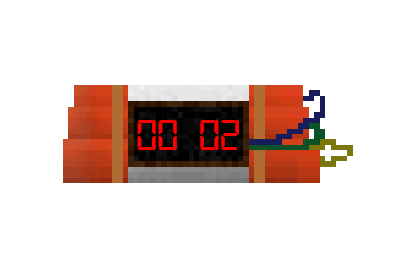

# stream-bomb-timer

A bomb timer to use on stream with OBS as a sort of pomodoro thing.

Usage: Create OBS browser source and set URL to `file:///path/to/index.html?minutes=15&seconds=0`.

It plays sound at start & end and an explosion sprite animation when timer reaches 0.
